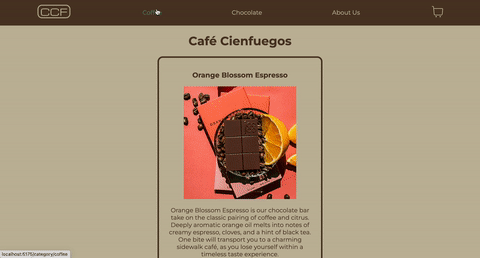

Café Cienfuegos fue el proyecto que estuve elaborando a lo largo del curso de React.JS. En el nos encontramos con las distintas categorías: Café y Chocolate. 
Cada uno de los Card tiene su propio contador, con límites, para poder agregar productos al carrito. En el carrito nos encontramos con toda la información de los productos que fueron agregados, precio por unidad, cantidad, imagen y luego la suma total del precio. Una vez que el usuario decide hacer la compra, un ID es generado en la base de datos de Firebase. 
